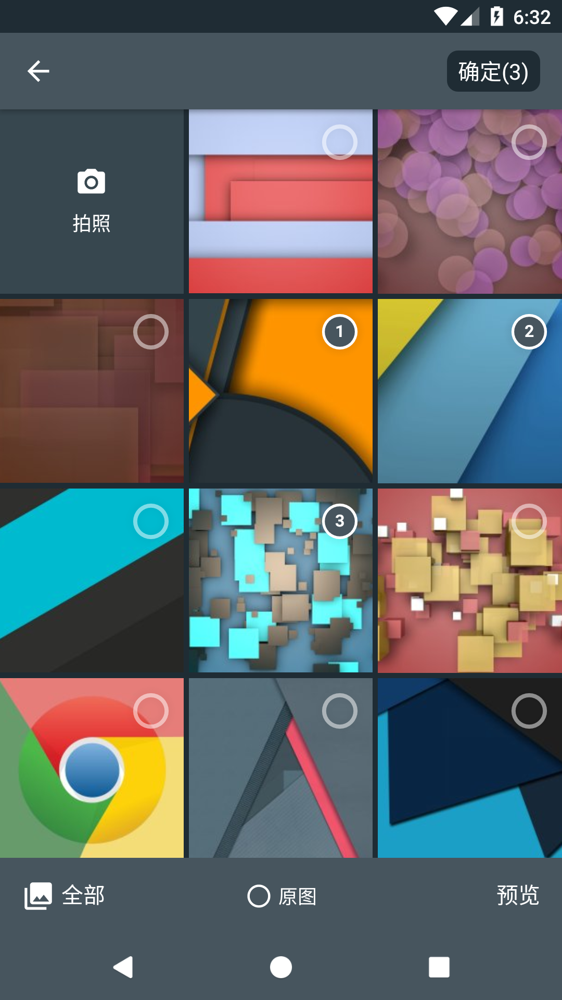
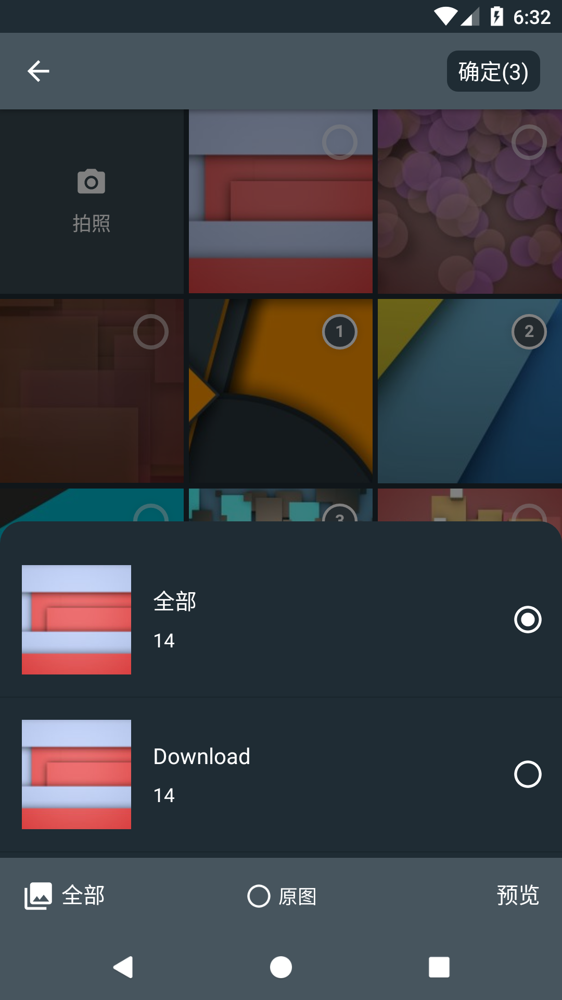
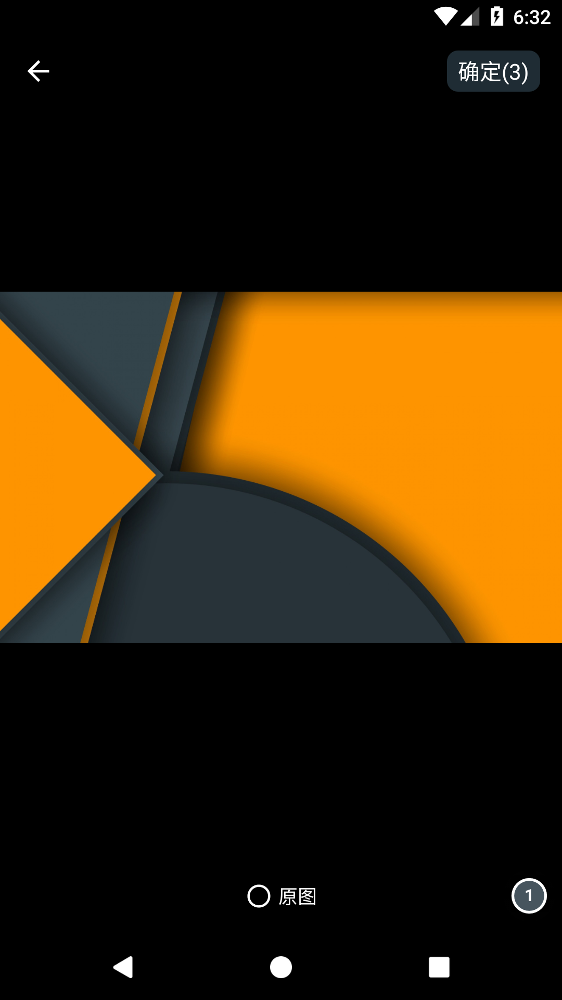

# Pejoy
 

Pejoy is a well-designed local image and video selector for Android and base on [Matisse](https://github.com/zhihu/Matisse). You can  
- Use it in Activity or Fragment
- Select images including JPEG, PNG, GIF and videos including MPEG, MP4 
- Apply different themes, including two built-in themes and custom themes
- Different image loaders
- Define custom filter rules
- More to find out yourself

## Preview
|Album							 |Album Category				     |Album Preview						|
|:------------------------------:|:---------------------------------:|:--------------------------------:|
|      |         |        |

## Download

gradle:
```groovy
dependencies {
    implementation 'io.github.keep2iron.pejoy:core:$latest_version'
	//provide imageloader engine
    implementation 'io.github.keep2iron.pejoy:engine:$latest_version'

    //optional compress image use Luban compress lib
    implementation 'io.github.keep2iron.pejoy:compress:$latest_version'
}
```

## Simple usage snippet
Two usages
- [Basic](#Basic)
  Only choose images

- [Expanded](#Expanded)
  choose images and compress them 

##### Init ImageLoaderManger

Since fresco is used to load images by default,so use [Pineapple](https://github.com/keep2iron/pineapple) lib load image.

```kotlin
ImageLoaderManager.init(
    application,
    ImageLoaderConfig(
        applicationContext,
        maxCacheCount = 300,									
        maxCacheSize = (400 * ByteConstants.MB).toLong(),
		cacheDirName = "cache_images",
		cacheDirPath =  context.cacheDir
    ),
    defaultImageLoaderOptions = ImageLoaderOptions(
        isCircleImage = true,
        scaleType = ImageLoaderOptions.ScaleType.FIT_CENTER,
        placeHolderRes = R.drawable.ic_launcher_background
    )
)
```

##### Basic

```kotlin
Pejoy.create(this)
    .choose(MimeType.ofAll(), false)
    .maxSelectable(3)
    .countable(true)
    .originalEnable(true)
    .capture(true, enableInsertAlbum = true)
    .imageEngine(FrescoImageEngine())
    .toObservable()
    .extractStringPath() //or extractUriPath()
    .subscribe { paths->
    }
```

##### Expanded

````kotlin
Pejoy.create(this)
    .choose(MimeType.ofAll(), false)
    .maxSelectable(3)
    .countable(true)
    .originalEnable(true)
    .capture(true, enableInsertAlbum = true)
    .imageEngine(FrescoImageEngine())
    .toObservable()
    .weatherCompressImage(this) // when original not checked.compress will execute.
    .subscribe { paths->
    }
````

## ProGuard

No need......

## License

	Copyright 2019 Keep2iron.
	
	Licensed under the Apache License, Version 2.0 (the "License");
	you may not use this file except in compliance with the License.
	You may obtain a copy of the License at
	
	    http://www.apache.org/licenses/LICENSE-2.0
	
	Unless required by applicable law or agreed to in writing, software
	distributed under the License is distributed on an "AS IS" BASIS,
	WITHOUT WARRANTIES OR CONDITIONS OF ANY KIND, either express or implied.
	See the License for the specific language governing permissions and
	limitations under the License.

