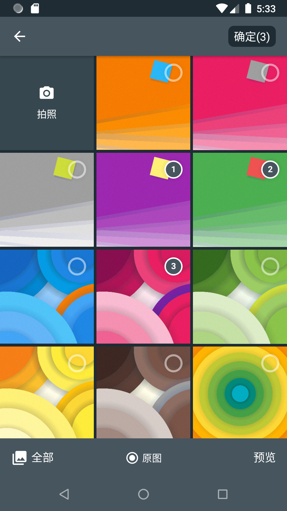
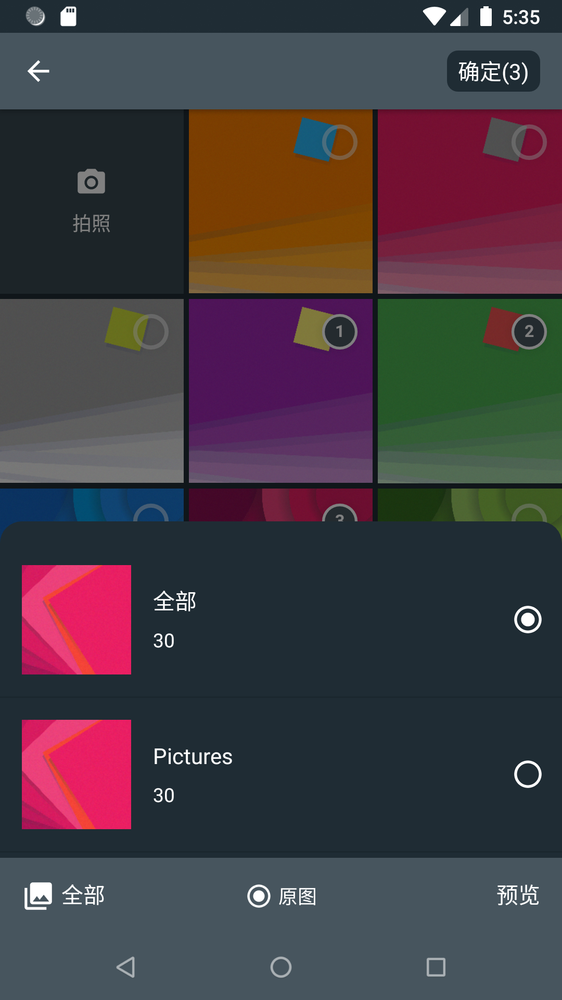
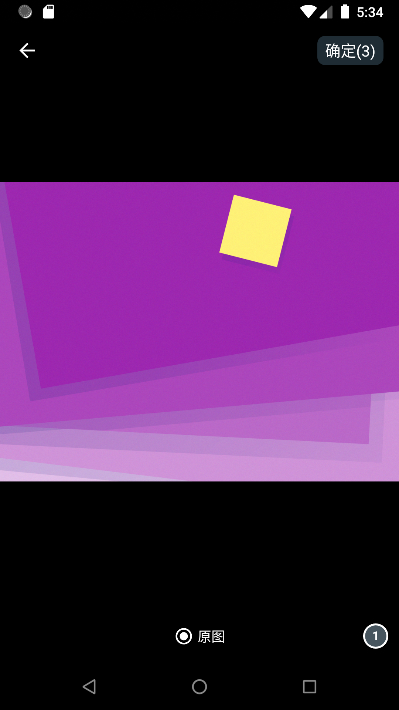
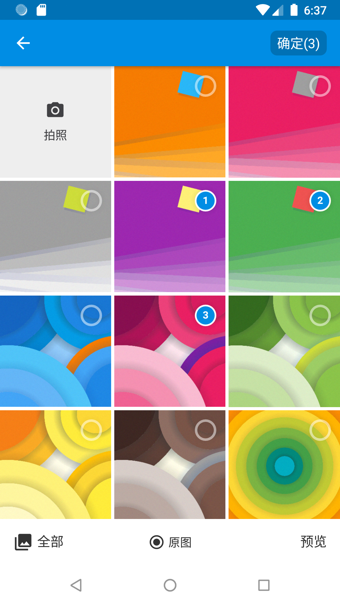
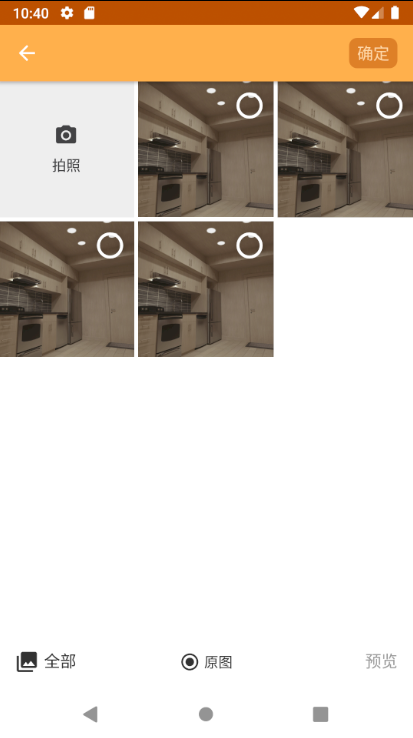
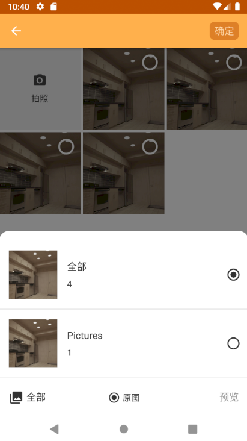

# Pejoy
 

|     名称     |                           版本                            |       描述       |
| :----------: | :----------------------------------------------------------: | :---------------------: |
|     core     |  | 图片选择核心lib |
| pejoy-fresco |  |    图片选择引擎    |
| pejoy-glide  |  |    图片选择引擎    |
|   compress   |  |     image compress      |


**Pejoy**是一个设计良好的Android本地图片选择和视频选择框架，基于[Matisse](https://github.com/zhihu/Matisse).

- 在Activity或Fragment随意使用
- 选择图片包括JPEG,PNG,GIF,视频包括MEPG，MP4
- 通过不同的主题来进行呈现，默认包含两种主题，支持自定义
- 可使用不同的图片加载器
- 可使用多种的过滤器
- 还有更多等着你发现

## Preview
|主题							 |相册							 |相册分类				     |相册预览						|
|:------------------------------:|:---------------------------------:|:--------------------------------:|--------------------------------|
|**Dracula**      |      |    |        |
|**Light** | |  | |
|**Custom** |  |  |  |

## 下载

gradle:
```groovy
dependencies {
    implementation 'io.github.keep2iron:pejoy-core:$latest_version'
	//provide imageloader engine
    implementation 'io.github.keep2iron:pejoy-engine:$latest_version'

    //optional compress image use Luban compress lib
    implementation 'io.github.keep2iron:pejoy-compress:$latest_version'
}
```

## 简单使用
两种使用方法
- [基础](#Basic)
  仅仅只是选择图片或视频

- [扩展](#Expanded)
  选择图片并且压缩他们 

##### 初始化ImageLoaderManger[可选]

由于使用了[Pineapple](https://github.com/keep2iron/pineapple) 所以需要在application onCreate的方法中添加如下代码.

```kotlin
ImageLoaderManager.init(
    application,
    ImageLoaderConfig(
        applicationContext,
        maxCacheCount = 300,									
        maxCacheSize = (400 * ByteConstants.MB).toLong(),
		cacheDirName = "cache_images",
		cacheDirPath =  context.cacheDir
    ),
    defaultImageLoaderOptions = ImageLoaderOptions(
        isCircleImage = true,
        scaleType = ImageLoaderOptions.ScaleType.FIT_CENTER,
        placeHolderRes = R.drawable.ic_launcher_background
    )
)
```

##### Basic

```kotlin
Pejoy.create(this)
    .choose(MimeType.ofAll(), false)
    .maxSelectable(3)
    .countable(true)
    .originalEnable(true)
    .capture(true, enableInsertAlbum = true)
    .toObservable()
    .extractStringPath() //or extractUriPath()
    .subscribe { paths->
    }
```

##### Expanded

````kotlin
Pejoy.create(this)
    .choose(MimeType.ofAll(), false)
    .maxSelectable(3)
    .countable(true)
    .originalEnable(true)
    .capture(true, enableInsertAlbum = true)
    .toObservable()
    .weatherCompressImage(this) // when original not checked.compress will execute.
    .subscribe { paths->
    }
````

##### Capture

````kotlin
Pejoy.create(this)
    .capture()
    .originalEnable(true)
    .toObservable()
    .weatherCompressImage(requireContext())
    .subscribe {
        imageResultBuilder.append("[\n")
        	it.forEach { uri ->
        		imageResultBuilder.apply {
        		append(uri)
        		if (uri != it.last()) {
        			append("\n")
        		} else {
        			append("\n]\n")
        		}
       		}
        }
        tvImageResult.text = imageResultBuilder.toString()
        Log.d("keep2iron", it.toString() + "this : " + this.hashCode())
    }
````

## ProGuard

No need......

## License

	Copyright 2019 Keep2iron.
	
	Licensed under the Apache License, Version 2.0 (the "License");
	you may not use this file except in compliance with the License.
	You may obtain a copy of the License at
	
	    http://www.apache.org/licenses/LICENSE-2.0
	
	Unless required by applicable law or agreed to in writing, software
	distributed under the License is distributed on an "AS IS" BASIS,
	WITHOUT WARRANTIES OR CONDITIONS OF ANY KIND, either express or implied.
	See the License for the specific language governing permissions and
	limitations under the License.

